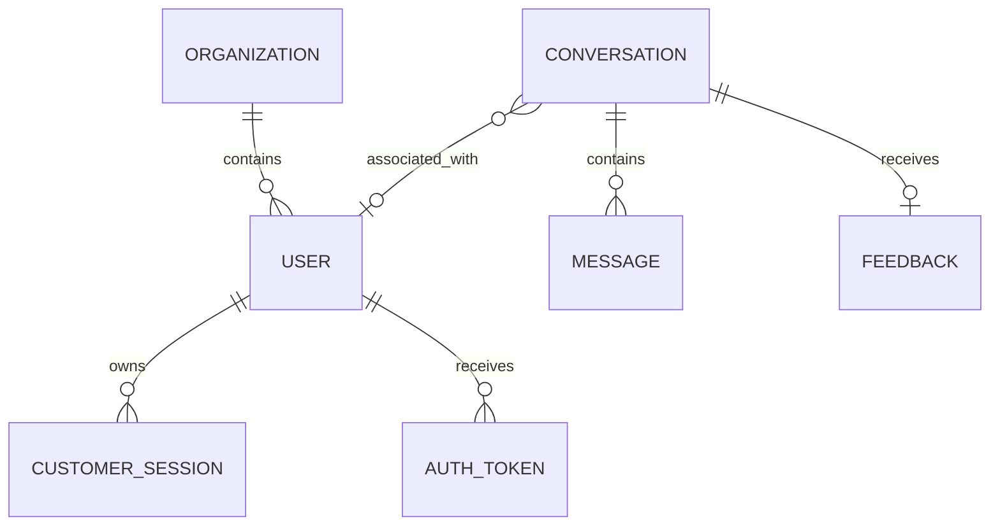

# Data Model

## Current conceptual entities

## Current MVP entities

### Organization

Represents the current business association used by customer accounts. Sprint 2 expands this into the formal tenant model.

### User

Stores customer identity, password hash, verification state, active state, and profile fields.

### Customer session

Stores opaque customer-session credentials and expiry/revocation state.

### Auth token

Represents email-verification and password-reset tokens with purpose, expiry, and consumption state.

### Conversation

Represents a contact request, service request, or async chat with status, priority, tags, and metadata.

### Message

Represents customer/admin messages and internal notes where applicable.

### Feedback

Stores optional response rating and comment associated with a conversation or response.

## Sprint 2 target

Introduce:

- organizations;
- sites;
- domains;
- users;
- organization memberships;
- organization roles;
- platform roles.

A user is not assigned a single global tenant-admin flag.
