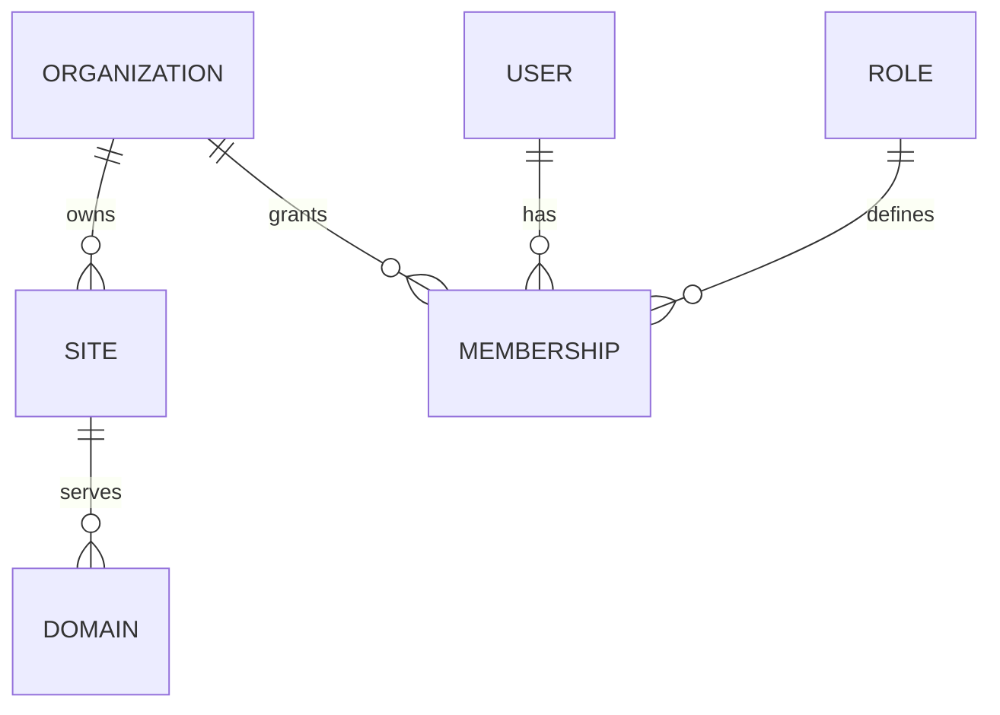

# Multi-Tenant Target Architecture

- Planned Sprint: 2
- Not current Sprint 1 implementation scope

## Core model

## Tenant resolution

- platform/account routes use the product host;
- public business routes resolve a site by normalized request hostname;
- tenant context is established before database queries;
- every tenant-owned record carries an organization/site key;
- tests verify cross-tenant access fails.

## Internal initial tenants

- Mad Mallard Solutions
- Mad Mallard Personal Training
- Mad Mallards Adventures

## Migration requirement

Current single-business records must be assigned to a seeded Mad Mallard Solutions organization/site without changing stable behavior.
