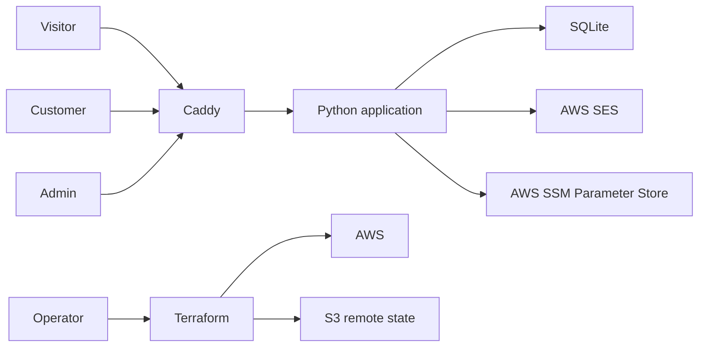

# System Architecture

- Status: Current baseline plus approved target evolution
- Architecture style: Modular monolith
- Deployment: Docker on AWS EC2 behind Caddy

## Context

## Current components

### Public site

Serves Mad Mallard Solutions content, contact forms, service requests, and async chat.

### Customer account subsystem

Provides registration, verification, login, logout, password reset, dashboard, and profile behavior. It uses database-backed users and customer sessions.

### Admin subsystem

Provides a separate bootstrap admin login and the approved operational dashboard. Admin credentials are loaded from SSM Parameter Store.

### Messaging subsystem

Stores conversations, messages, status, priority, tags, notes, and feedback in SQLite.

### Notification subsystem

Uses SES for transactional notifications.

### Deployment subsystem

Terraform manages AWS resources and application deployment. Caddy terminates TLS and proxies to the application container.

## Architectural constraints

- No premature microservices.
- No RDS until workload and durability justify cost.
- No tenant feature implementation during Sprint 1.
- Customer and admin authentication remain isolated.
- Infrastructure remains reproducible.
- Runtime data survives application container replacement.
