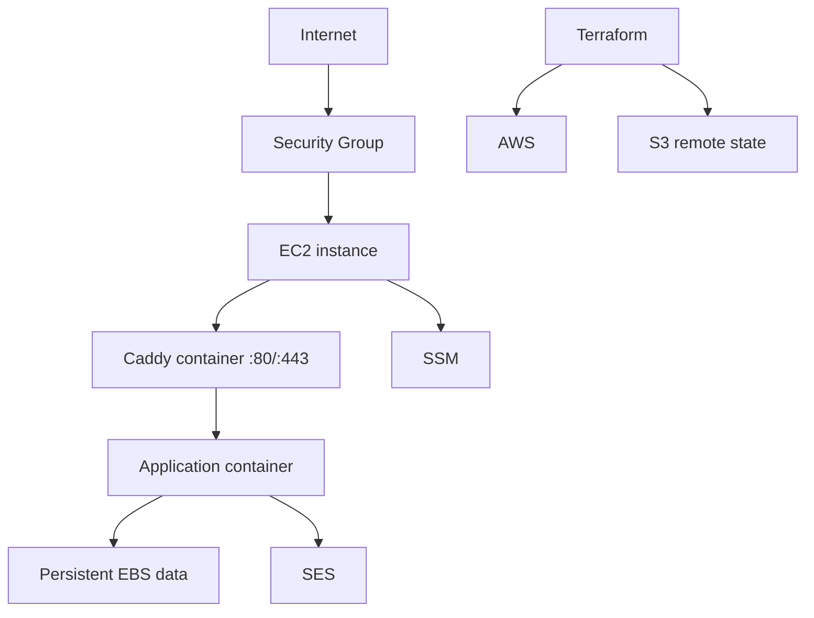

# AWS Architecture

## Current topology

## Services

- EC2 — application host.
- EBS — host/container persistent data.
- S3 — Terraform state and deployment artifacts.
- SES — transactional email.
- SSM Parameter Store — bootstrap admin secrets.
- IAM — EC2 and deployment permissions.
- VPC/security groups — network boundary.
- CloudWatch/SSM execution history — available operational evidence.

## Cost position

The design intentionally avoids RDS, NAT Gateway, Route 53, load balancers, and Elastic IP where not yet justified.

## Growth triggers

Adopt managed database, load balancing, multi-instance application, or enhanced monitoring only when reliability, concurrency, or customer commitments justify the expense.
